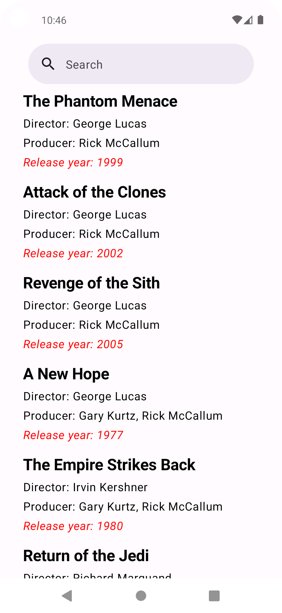
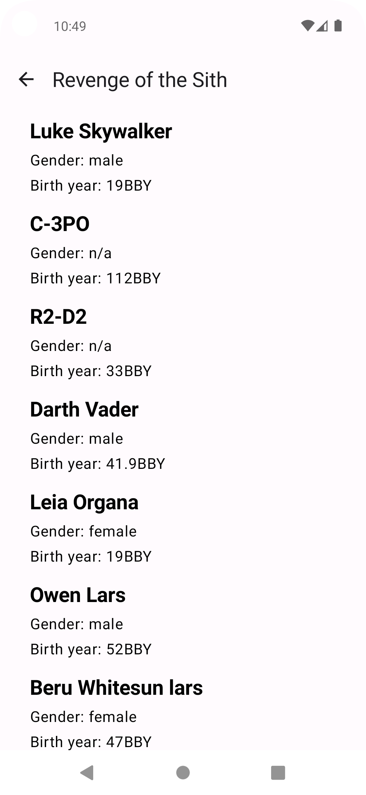
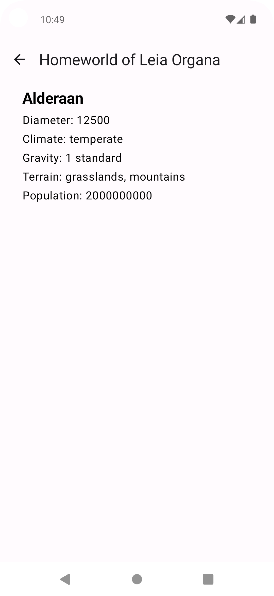

# STAR WARS

Android app showing Star Wars data from [SWAPI](https://swapi.dev/) 

Tech stack overview:
- Android SDK
- [Android Jetpack](https://developer.android.com/jetpack)
- [Kotlin](https://kotlinlang.org/)
- [KotlinX Coroutines](https://github.com/Kotlin/kotlinx.coroutines)
- [KotlinX Serialization](https://github.com/Kotlin/kotlinx.serialization)
- [Retrofit](https://square.github.io/retrofit/) + [OkHttp](https://square.github.io/okhttp/)
- [Jetpack Compose](https://developer.android.com/develop/ui/compose)
- [Dagger](https://dagger.dev) + [Hilt](https://dagger.dev/hilt/)
- [Jetpack Room](https://developer.android.com/jetpack/androidx/releases/room)
- [Material](https://github.com/material-components/material-components-android)
- [Lottie](https://lottiefiles.com/)

Modules:
- core:*
- features:*
- app

&nbsp;&nbsp;

